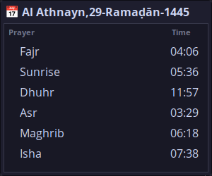
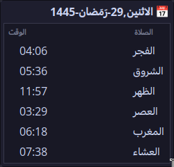

# Statusbar Prayer Times


<br/>



- The prayer times script is inspired by [Nofarah Tech](https://www.youtube.com/@NofarahTech) prayer times scripts. In Addition, I added support for statusbars like [waybar](https://github.com/Alexays/Waybar) and desktop notifications.

### Dependencies

- `wget`
- `at`
- `yad`
- `mpv`
- `dunst` (x11)
- `polybar` (x11)
- `mako` (wayland)
- `waybar` (wayland)
- [Nerd Font](https://www.nerdfonts.com/) (optional)

### Procedures

1. Copy files to their corresponding location on your system
2. Modify the location latitude and longitude in `.local/bin/prayer-times` to match your location
3. Set the print lang in `.local/bin/prayer-times` (options: `en`, `ar`)
4. Activate systemd user unit
5. Add statusbar module
6. Add notification daemon rule
7. Configure Yad dialog to show in floating mode

### Systemd Unit

- Run one of the following commands to activate the service for your user
  - `systemctl --user enable --now prayer-times.service # start on boot`
  - `systemctl --user enable --now prayer-times.timer # start on boot + every 8 hours`

### Statusbar Module

#### Polybar

- Add the following to your [polybar config](https://github.com/polybar/polybar/wiki/Configuration) file (`~/.config/polybar/config[.ini]`) then add the module
- Modify colors according to your liking (replace #83CAFA)

```ini
[module/prayers]
type = custom/script
exec = $HOME/.local/bin/prayer-times status
interval = 60
label = %{A:$HOME/.local/bin/prayer-times yad:}%{F#83CAFA}󱠧 %{F-} %output%%{A}
```

#### Waybar (Wayland)

- Add the following custom module to your [waybar config](https://github.com/Alexays/Waybar/wiki/Configuration) (`~/.config/waybar/config`)

```json
"custom/prayers": {
  "interval": 60,
  "return-type": "json",
  "exec": "$HOME/.local/bin/prayer-times waybar",
  "on-click": "$HOME/.local/bin/prayer-times yad",
  "format": "󱠧  {}",
}
```

### Notification Athan

#### Dunst

- Add the following rule to your dunstrc file (`~/.config/dunst/dunstrc`)
- Replace `USERNAME` with your account username

```ini
[play_athan]
summary = "Prayer Times"
script = "/home/USERNAME/.local/bin/play-athan"
```

#### Mako (Wayland)

- Add the following criteria/rule to mako config (`~/.config/mako/config`)

```ini
[summary="Prayer Times"]
on-notify=exec $HOME/.local/bin/play-athan
```

### Yad Dialog

- Window Title: `Prayers`
- Configure your window manager to show the Yad window in floating mode and you're all set!
- Example window rule for [Hyprland](https://hyprland.org/)

```ini
windowrulev2 = float,class:(yad)
windowrulev2 = move cursor -50% 30,title:(Prayers)
```

### References

- Nofarah Tech | نوفرة تك ([video](https://www.youtube.com/watch?v=BnSXo5p1ZLw)) ([dotfiles](https://github.com/HishamAHai/dotfiles/tree/main/.local/bin))
- [Aladhan API](https://aladhan.com/prayer-times-api#GetTimings)
- [Polybar config](https://github.com/polybar/polybar/wiki/Module:-script)
- [Default dunstrc](https://github.com/dunst-project/dunst/blob/master/dunstrc)
- [Mako(5)](https://github.com/emersion/mako/blob/master/doc/mako.5.scd)
- [Waybar Custom Module](https://github.com/Alexays/Waybar/wiki/Module:-Custom)
