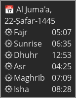
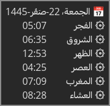

# Linux statusbar prayer times


<br/>




- The prayer times scripts are a modified version of [Nofarah Tech](https://www.youtube.com/@NofarahTech) prayer times scripts to work with polybar, dunst, and yad. 

### Dependencies
- `wget`
- `at`
- `yad`
- `mpv`
- `dunst` (optional)
- `polybar` (optional)

### Procedures

1. Copy files to their corresponding location on your system

2. Modify the location latitude and longitude in `.local/bin/prayer-times.sh` to match your location

3. Activate systemd user service & timer units

4. Modify notification system config if using another notifications daemon

### Systemd

- Run the following to activate the service for your user

```sh
systemctl --user enable --now prayer-times.service
systemctl --user enable --now prayer-times.timer
```

### Polybar

- Add the following to your [polybar config](https://github.com/polybar/polybar/wiki/Configuration) file (~/.config/polybar/config\[.ini\]) then add the module

- Modify colors according to your liking (replace #83CAFA)

- Works best with [Nerd Fonts](https://nerdfonts.com)

```ini
[module/prayers]
type = custom/script
exec = $HOME/.local/bin/prayer.sh
interval = 60
label = %{A:$HOME/.local/bin/prayer-times-yad.sh:}%{F#83CAFA}󱠧 %{F-} %output%%{A}
```

### Yad

- Configure your window manager to show the Yad window in floating mode and you're all set!

### References

- Nofarah Tech | نوفرة تك ([video](https://www.youtube.com/watch?v=BnSXo5p1ZLw)) ([dotfiles](https://github.com/HishamAHai/dotfiles/tree/main/.local/bin))
- [Aladhan API](https://aladhan.com/prayer-times-api#GetTimings)
- [Polybar config](https://github.com/polybar/polybar/wiki/Module:-script)
- [Default dunstrc](https://github.com/dunst-project/dunst/blob/master/dunstrc)
